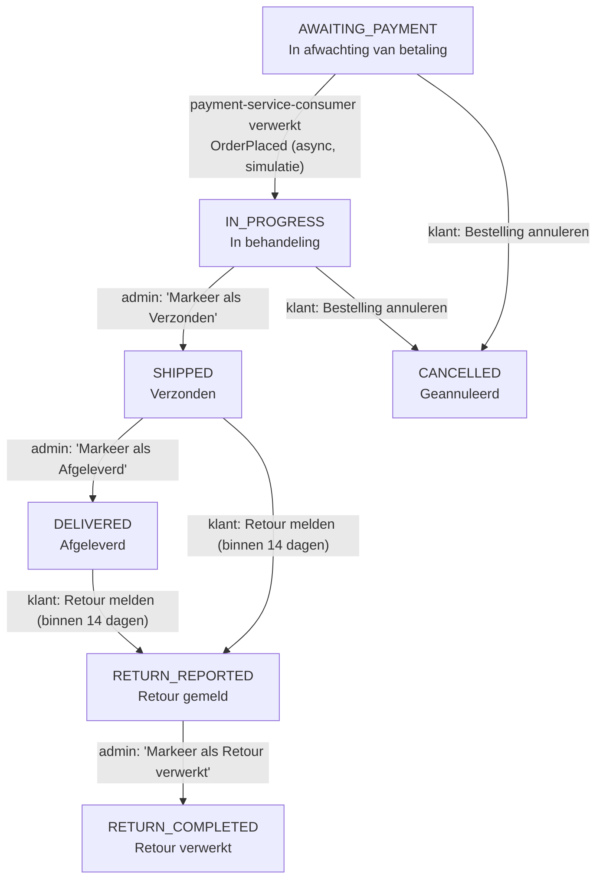

# Nordic Wonen — Serverless Event-Driven Webshop (PoC)

**🔗 Live demo:** [webshop-aws-python.kabulter.click](https://webshop-aws-python.kabulter.click)

## Wat doet deze applicatie?

Nordic Wonen is een webshop voor bureaulampen. Bezoekers bladeren door de catalogus,
sorteren op prijs en filteren op kleur, voegen lampen toe aan hun winkelwagen en rekenen af
— als gast, of als geregistreerde klant. Geregistreerde klanten loggen in via een eigen
account (AWS Cognito) en krijgen een persoonlijke omgeving: profiel- en adresgegevens
beheren, eerdere bestellingen inzien, en — zolang de status het toelaat — een bestelling
annuleren of een retour melden. Een aparte, afgeschermde beheeromgeving geeft de
winkelbeheerder (1 vaste admin-account) een dashboard met kerncijfers, orderbeheer
inclusief retourverwerking, product-/voorraadbeheer, en klantenbeheer.

Onder de motorkap draait dit volledig serverless op AWS (Lambda, DynamoDB, EventBridge,
SQS, Cognito); de rest van dit document behandelt die architectuur, de
beveiligingsmaatregelen en de teststrategie in detail.

**Demo-inloggegevens.** Dit is een portfolio-demo, geen productieomgeving — de volgende
twee accounts staan bewust klaar, zowel in de live demo als lokaal (zie
[Lokaal draaien](#lokaal-draaien)), zodat iedereen meteen kan inloggen en rondkijken, zonder
zelf eerst te hoeven registreren:

| Rol | E-mailadres | Wachtwoord |
|---|---|---|
| Admin (toegang tot `/admin/*`) | `admin@demo.nl` | `Demo1234!` |
| Klant | `klant@demo.nl` | `Demo1234!` |

Deze inloggegevens zijn met opzet publiek in dit document — geef dus nooit echte
persoonsgegevens of een wachtwoord dat je elders hergebruikt op aan deze accounts. Gebruik
desgewenst gewoon `/register` voor een eigen, privé testaccount; nieuwe accounts krijgen
automatisch de klantrol (zie [Gebruikersrollen & authenticatie](#gebruikersrollen--authenticatie)).

> **Architectural & QA Automation Proof of Concept.** Dit is een portfolioproject dat een
> serverless, event-driven webshop-architectuur op AWS demonstreert: schone Python-code,
> Infrastructure as Code met Terraform, een single-table DynamoDB-datamodel, ontkoppeling via
> EventBridge + SQS, en een tweelaagse geautomatiseerde teststrategie (pytest/moto +
> Playwright E2E).

**Disclaimer:** dit project is **niet gelieerd aan IKEA®** en niet bedoeld voor commercieel
gebruik. De lay-out is in IKEA-stijl en de productfoto's zijn **hotlinked** vanaf
`ikea.com` (`bureaulampen-20502`) — ze worden dus rechtstreeks vanaf IKEA's eigen CDN
geladen door de browser van de bezoeker, en nooit gedownload, gekopieerd of opnieuw gehost.
De producttitels/codenamen (bijv. "VINDLYS", "BJORKVIK") zijn **verzonnen** en komen niet
overeen met de echte IKEA-productnamen, om hergebruik van handelsmerken te vermijden.

## Inhoudsopgave

1. [Architectuuroverzicht](#architectuuroverzicht)
2. [Projectstructuur](#projectstructuur)
3. [DynamoDB single-table design](#dynamodb-single-table-design)
4. [Gebruikersrollen & authenticatie](#gebruikersrollen--authenticatie)
5. [Klantomgeving](#klantomgeving)
6. [Admin-backoffice](#admin-backoffice)
7. [Event-driven architectuur: waarom EventBridge + SQS in plaats van SNS](#event-driven-architectuur-waarom-eventbridge--sqs-in-plaats-van-sns)
8. [Orderstatus-levenscyclus](#orderstatus-levenscyclus)
9. [OWASP Top 10 (2025) — beveiligingsmaatregelen](#owasp-top-10-2025--beveiligingsmaatregelen)
10. [Lokaal draaien](#lokaal-draaien)
11. [Testen](#testen)
12. [Infrastructure as Code (Terraform)](#infrastructure-as-code-terraform)
13. [Deployment naar AWS](#deployment-naar-aws)
14. [GitHub Actions (CI/CD)](#github-actions-cicd)
15. [Verwachte AWS-kosten (± 100 API-calls/dag)](#verwachte-aws-kosten--100-api-callsdag)
16. [Scope en beperkingen](#scope-en-beperkingen)

## Architectuuroverzicht

```
Browser (HTMX + Tailwind CDN)
        │  HTTPS
        ▼
webshop-aws-python.kabulter.click  (Route53 alias + ACM-cert, regionaal)
        │
        ▼
API Gateway (HTTP API)
        │  AWS_PROXY
        ▼
Lambda: webshop-main-app  (Flask via Mangum/ASGI, server-side rendered HTML-fragmenten)
        │
        ├── DynamoDB: WebshopTable  (producten, winkelwagens, orders, profielen, sessies)
        │
        ├── Cognito User Pool  (registratie/login/wachtwoordherstel, boto3, geen Hosted UI)
        │
        └── EventBridge custom bus: webshop-event-bus
                 │  PutEvents("OrderPlaced")
                 ├── Rule payment-rule      ──► SQS payment-service-queue      ──► Lambda webshop-payment-service
                 ├── Rule inventory-rule    ──► SQS inventory-service-queue    ──► Lambda webshop-inventory-service
                 └── Rule notification-rule ──► SQS notification-service-queue ──► Lambda webshop-notification-service
                       (elke queue heeft een eigen DLQ voor fault isolation)
```

**Tech stack**

| Laag | Keuze |
|---|---|
| Frontend | HTMX (CDN, met SRI-hash) + Tailwind CSS Play CDN (CDN, gepinde versie-URL; geen SRI mogelijk, zie A03) |
| Backend | Python, Flask, gerenderd via `asgiref` + Mangum op AWS Lambda |
| Data | Amazon DynamoDB, single-table design |
| Auth | Amazon Cognito User Pool, aangestuurd via `boto3` (geen Hosted UI/OAuth-redirect) |
| Events | Amazon EventBridge (custom bus) → fan-out naar 3 Amazon SQS-queues |
| IaC | Terraform (modules per component, incl. custom domain + GitHub OIDC) |
| Tests | pytest + moto (integratie), Playwright (Python, E2E) |
| Tooling | [uv](https://docs.astral.sh/uv/) voor Python-versie- én dependency-beheer (`pyproject.toml` + `uv.lock`) |
| CI/CD | GitHub Actions: tests en code-only deploy, beide uitsluitend handmatig, deploy via OIDC (geen AWS-sleutels in GitHub) |

De Flask-app is bewust **niet** ASGI-native geschreven (Flask is WSGI); `asgiref.wsgi.WsgiToAsgi`
verpakt de WSGI-app zodat Mangum — dat zelf een ASGI-adapter is — hem op Lambda kan draaien.

## Projectstructuur

```
webshop-aws-python/
├── pyproject.toml + uv.lock    # dependencies, dev-tools en het gepinde uv-lockbestand
├── .python-version             # pint de Python-versie (3.13) die `uv` gebruikt
├── docs/owasp-top-10.md        # uitgebreide risico-uitleg per OWASP-categorie
├── .github/workflows/
│   ├── tests.yml                # integratie + E2E tests, uitsluitend handmatig
│   └── deploy.yml                # handmatige, code-only deploy naar AWS (OIDC, geen secrets)
├── terraform/                 # IaC: root config + modules/{dynamodb,eventbridge,sqs,lambda,
│                               #      api_gateway,custom_domain,github_oidc,cognito}
│   └── backend.env.example     # template voor terraform/backend.env (gitignored)
├── app/                       # Flask-applicatie (main app Lambda)
│   ├── main.py                 # Flask app + security headers + Mangum handler
│   ├── aws_clients.py          # boto3-clients, endpoint-url-aware (voor lokale moto-tests)
│   ├── auth/                   # cognito.py (boto3-wrapper + SECRET_HASH), session.py
│   │                           # (SESSION#-item CRUD + g.current_user), decorators.py
│   ├── models/                 # Product/ProductVariant, CartItem, Order/OrderLine,
│   │                           # UserProfile/Address, ReturnRequest (dataclasses)
│   ├── repositories/           # single_table.py: alle DynamoDB-toegang
│   ├── routes/                 # catalog, cart, checkout, auth, account, admin (blueprints)
│   ├── events/                 # publisher.py: OrderPlaced naar EventBridge
│   ├── templates/               # Jinja2 + HTMX-fragmenten (incl. auth/, account/, admin/)
│   └── seed/products.json      # 22 lampen (uit ikea.com/nl/nl/cat/bureaulampen-20502)
├── consumers/                  # 3 losse consumer-Lambda's (payment/inventory/notification)
├── scripts/
│   ├── bootstrap_local_infra.py  # lokaal (moto) alleen: tabel/queues/Cognito-pool/demo-accounts
│   ├── seed_products.py          # laadt products.json in een al-bestaande tabel (lokaal óf echt AWS)
│   ├── run_local_consumers.py    # lokaal (moto) alleen: pollt de queues i.p.v. een Lambda-trigger
│   ├── restart_local_dev.sh      # stopt/herstart de volledige lokale dev-stack in één keer
│   └── bootstrap_terraform_backend.sh  # eenmalige, idempotente backend-setup (S3 + DynamoDB)
└── tests/
    ├── conftest.py              # ThreadedMotoServer + tabel/bus/queues bootstrap
    ├── integration/             # pytest + moto
    └── e2e/                     # Playwright tegen een echte `flask run` + moto
```

## DynamoDB single-table design

Eén tabel, `WebshopTable`, met samengestelde sleutel `PK`/`SK` en twee GSI's.

| Entiteit | PK | SK | Belangrijkste attributen |
|---|---|---|---|
| Product | `PRODUCT#<id>` | `METADATA` | title, price_cents, image_url, colors[], rating |
| Productvariant | `PRODUCT#<id>` | `VARIANT#<color>` | stock_qty (handmatig bijgewerkt door een admin) |
| Winkelwagenregel | `CART#<cart_id>` | `ITEM#<product_id>` | quantity, price_cents (snapshot), color |
| Order | `ORDER#<order_id>` | `METADATA` | status, total_cents, created_at, user_sub (afwezig bij gast-orders) |
| Orderregel | `ORDER#<order_id>` | `ITEM#<product_id>` | quantity, price_cents (snapshot), color |
| Retour | `ORDER#<order_id>` | `RETURN` | reason, reported_at — max. 1 per order (`ConditionExpression`) |
| Klantprofiel | `USER#<sub>` | `PROFILE` | email, given_name, family_name, shipping_address{}, billing_address{} |
| Sessie | `SESSION#<session_id>` | `METADATA` | cognito_sub, email, groups[], cart_id, csrf_token, expires_at (TTL) |

**GSI1** (`CATEGORY#PRICE-index`) bedient twee query-patronen via dezelfde index:

- Catalogus, gesorteerd op prijs: `GSI1PK = "CATEGORY#DESK_LAMPS"`,
  `GSI1SK = "PRICE#<price_cents, zero-padded naar 8 cijfers>"`.
- "Bestellingen van deze klant" (sparse — gast-orders zetten deze keys nooit):
  `GSI1PK = "USER#<sub>"`, `GSI1SK = "ORDER#<created_at>#<order_id>"`.

De zero-padding is bewust: zonder padding sorteren prijzen als strings lexicografisch
(`"999" < "1299"` klopt toevallig, maar `"1999" > "19999"` niet), wat tot een stille,
foute sortering leidt. Sorteerrichting wordt bepaald door `ScanIndexForward`
(`True` = laag→hoog, `False` = hoog→laag). Kleurfilter gebeurt met een
`FilterExpression` (`Attr("colors").contains(color)`) bovenop de GSI-query — voor de
schaal van deze PoC-catalogus (22 items) is dat prima.

**GSI2** bedient de admin-brede lijsten — single-partition buckets, dezelfde
denormalisatie-afweging als `GSI1PK="CATEGORY#DESK_LAMPS"` hierboven, nu toegepast op
*alle* orders en *alle* retouren in plaats van op één klant:

- Alle orders (gast én klant): `GSI2PK = "ORDER"`, `GSI2SK = "<created_at>#<order_id>"`.
- Alle openstaande retouren: `GSI2PK = "RETURN"`, `GSI2SK = "<reported_at>#<order_id>"`.

Statusfilters op het admin-orderoverzicht gebeuren met een `FilterExpression`, niet met
een aparte index per status — dezelfde keuze als het kleurfilter hierboven, en om dezelfde
reden: de schaal van dit PoC-orderaantal rechtvaardigt geen extra index, en een
status-wijziging hoeft zo nooit de GSI2-sleutels te raken.

Het Sessie-item's `expires_at` heeft een table-level TTL, maar dat is **opslaghygiëne,
geen beveiligingsmaatregel**: DynamoDB's TTL-verwijdering is best-effort en kan vertraagd
zijn, dus de applicatie controleert verlopen sessies altijd zelf
(`app/auth/session.py::resolve_current_user`).

## Gebruikersrollen & authenticatie

Twee rollen: geregistreerde **klanten** en exact **1 vaste admin**-account. Er bestaat
bewust **geen aparte `Customers`-Cognito-groep** — het ontbreken van groepslidmaatschap
is de standaard "klant"-status; alleen de `Admins`-groep is echt. Dat is een bewuste
vereenvoudiging die past bij "1 vaste administrator": één echte groep om te beheren, niet
twee.

Cognito wordt uitsluitend via `boto3` aangestuurd (`app/auth/cognito.py`) — geen Hosted
UI, geen OAuth-redirect-flow, want dit is een server-side gerenderde Flask-app, geen SPA.
De App Client is een **confidential client** (`generate_secret = true`): elke Cognito-call
gebeurt server-side in de Lambda, dus een bewaard secret is hier de juiste keuze. Elke
aanroep draagt een `SECRET_HASH` (`base64(HMAC-SHA256(client_secret, username+client_id))`
— `.digest()` + base64, niet `.hexdigest()`, een veelgemaakte fout).

**Sessieontwerp** (`app/auth/session.py`): de bestaande signed-maar-niet-versleutelde
sessiecookie bevat nooit een ruwe Cognito-token, alleen één ondoorzichtige `session_id`
(`secrets.token_urlsafe(32)` — een credential, dus bewust niet `uuid4()`). De echte
sessiedata leeft server-side in een `SESSION#<id>`-item (zie de tabel hierboven). Dat
maakt ook **echte server-side logout** mogelijk: het item verwijderen beëindigt de sessie
overal onmiddellijk, iets wat een signed/versleutelde cookie alleen nooit kan.

- **Geen refresh-token wordt bewaard** — een bewuste vereenvoudiging. Sessies zijn
  vast 8 uur geldig, geen stille verlenging. Te kort gebleken in de praktijk? Dan is
  `REFRESH_TOKEN_AUTH` een expliciete, toekomstige uitbreiding.
- De `session_id` wordt bij elke login geroteerd (sessie-fixatie-verdediging); de
  gast-`cart_id` wordt daarbij wél meegenomen naar de nieuwe sessie, zodat een winkelwagen
  nooit stilletjes verdwijnt bij het inloggen.
- Groepslidmaatschap wordt **bij login** opgehaald via `AdminListGroupsForUser`
  (IAM-geautoriseerd) en in de sessie gecachet — **de app decodeert nergens een JWT**. Dat
  geeft een verwaarloosbaar "staleness window" (een admin-rechten-intrekking werkt pas na
  sessieverval), acceptabel met precies 1 vaste admin.
- **MFA staat uit** (`mfa_configuration = "OFF"`) — een bewuste, benoemde PoC-scope-keuze,
  geen vergeten instelling.

De ene vaste admin-gebruiker wordt **buiten Terraform om** aangemaakt (zie
[Deployment naar AWS](#deployment-naar-aws)) — hetzelfde patroon als `SECRET_KEY` in SSM:
niet in Terraform-state, om een wachtwoord daar nooit in terecht te laten komen.

## Klantomgeving

Alles onder `/account/*` (`app/routes/account.py`, blueprint-breed `before_request` die
niet-ingelogde bezoekers naar `/login` stuurt) en elke state-wijzigende `POST` daarin
valideert een per-sessie **CSRF-token** (`hmac.compare_digest`, nieuw in deze fase — de
gast-winkelwagen leunde tot nu toe alleen op `SameSite=Lax`).

| Route | Wat het doet |
|---|---|
| `GET/POST /account` | Mijn profiel — persoonsgegevens + aflever-/factuuradres |
| `GET /account/orders` | Mijn bestellingen — overzicht met status |
| `GET /account/orders/<id>` | Orderdetail — **404, niet bestaand of niet van jou is niet te onderscheiden** |
| `POST /account/orders/<id>/cancel` | Annuleren — alleen mogelijk bij status "In afwachting van betaling"/"In behandeling" |
| `POST /account/orders/<id>/return` | Retour melden — alleen bij "Verzonden"/"Afgeleverd", binnen `RETURN_WINDOW_DAYS` (standaard 14 dagen), met verplichte reden |

Elke eligibility-check (annuleerbaar? binnen de retourtermijn?) wordt **server-side
herverifieerd** op de `POST` zelf, met een `ConditionExpression`-guard op de huidige status
— dezelfde discipline als checkout's server-side prijsherberekening. Een order-detailpagina
voor een order die niet bestaat, of van iemand anders is, geeft exact dezelfde `404` (zie
A01 hieronder) — de route vertakt nooit op "bestaat dit?" vóór de eigendomscheck.

## Admin-backoffice

Alles onder `/admin/*` (`app/routes/admin.py`) wordt afgeschermd door een
blueprint-brede `before_request` — bewust **geen per-route decorator** als primaire
verdediging, want die kan op route veertien vergeten worden; een blueprint-hook kan dat
structureel niet. Net als bij klant-orders: een niet-admin (ingelogd of niet) krijgt overal
**404, nooit 403**.

| Route | Wat het doet |
|---|---|
| `GET /admin` | Dashboard — aantal orders per status, aantal openstaande retouren, recente orders |
| `GET /admin/orders` | Orderoverzicht, filterbaar op status |
| `GET /admin/orders/<id>` | Orderdetail + "markeer als volgende status"-knop (In behandeling→Verzonden→Afgeleverd; Retour gemeld→Retour verwerkt) |
| `GET /admin/returns` | Retourenwachtrij — alle openstaande retouren |
| `GET /admin/products` | Productoverzicht met totale voorraad per product |
| `GET/POST /admin/products/<id>` | Voorraadbeheer per kleurvariant (handmatig bijvullen) |
| `GET /admin/customers` | Klantenlijst (Cognito `ListUsers`) |
| `GET /admin/customers/<email>` | Klantdetail: profiel + bestelgeschiedenis |

**Bewuste scope-afbakening: geen automatische voorraadverlaging bij checkout.** Dat zou
`dynamodb:TransactWriteItems` vereisen (niet in de huidige IAM-policy) én een uitbreiding
van het `OrderPlaced`-event (dat vandaag geen orderregels bevat, alleen
`order_id`/`total_cents`/`item_count`/`notify`). **Aanvullen** van voorraad is dus
uitsluitend een handmatig bij te werken scherm — een expliciete, benoemde beperking, geen
half afgemaakte functie.

**Voorraad wordt wél verlaagd, maar pas bij verzenden, niet bij checkout.** Wanneer een
admin op de orderdetailpagina op "Markeer als 'Verzonden'" klikt
(`IN_PROGRESS` → `SHIPPED`, zie [Orderstatus-levenscyclus](#orderstatus-levenscyclus)),
controleert `app/routes/admin.py::_stock_shortages` eerst of er voor **elke** orderregel
genoeg voorraad is voor de bestelde kleur. Is dat niet zo, dan toont de pagina een rode
waarschuwing met precies welke producten tekortschieten (met een link naar het
voorraadscherm) **in plaats van** de verzend-knop — er is dus geen manier om een order te
verzenden zonder genoeg voorraad, zowel in de UI als server-side
(`single_table.decrement_variant_stock`, met een `ConditionExpression` die de voorraad
nooit negatief laat worden). Is er wel genoeg, dan verlaagt elke regel de voorraad van zijn
eigen kleurvariant **op het moment van verzenden** — bewust later dan checkout, zodat dit
geen `TransactWriteItems` nodig heeft (een enkele, synchrone admin-actie is hier
inherent race-arm, in tegenstelling tot gelijktijdige checkouts van losse klanten).
**Eerlijke kanttekening:** de decrement per orderregel loopt niet in dezelfde transactie
als de statusovergang zelf — bij een orderline die faalt ná een eerdere regel die al wél
is verlaagd (alleen mogelijk via een echte race, niet het normale "geen voorraad"-pad)
wordt die eerdere verlaging niet teruggedraaid, exact om dezelfde IAM-reden als hierboven.

**Een admin heeft geen winkelwagen.** De rolscheiding werkt ook de andere kant op: een
admin-account koopt niets, dus `/cart/*` en `/checkout` geven `404` zodra
`current_user.is_admin` waar is (`app/routes/cart.py`/`app/routes/checkout.py`, dezelfde
blueprint-brede `before_request`-gate als elders), en de navigatiebalk toont geen
"Winkelwagen"-link voor een admin. Inloggen als admin **laat ook geen gast-winkelwagen
staan** die toevallig al in dezelfde browser zat — `app/auth/session.py::login_user` neemt
een bestaande `cart_id` alleen over voor klanten, nooit voor een admin.

## Event-driven architectuur: waarom EventBridge + SQS in plaats van SNS

Bij het plaatsen van een order publiceert de main-app-Lambda **één** `OrderPlaced`-event op
een custom EventBridge-bus. Drie regels routeren dat ene event naar drie losse
SQS-queues, die elk hun eigen consumer-Lambda triggeren via een **native SQS
event-source mapping** (dus SQS polling, niet EventBridge die de Lambda's rechtstreeks
aanroept — dat houdt de queues, en daarmee de retry/DLQ-semantiek, in de architectuur).

**Waarom EventBridge (+ SQS) in plaats van Amazon SNS (+ SQS)?** Beide kunnen fan-out naar
SQS. Het verschil zit in wat je er verder mee kan:

1. **Content-based routing.** SNS filtert op *message attributes* die je apart moet
   meesturen naast de payload. EventBridge filtert direct op de JSON-structuur van het
   event zelf (`source`, `detail-type`, en willekeurige velden onder `detail`). In dit
   project matcht de `notification-rule` bijvoorbeeld op `detail.notify: true` — een
   inhoudelijke conditie op het event, niet op een los attribuut.
2. **Schema Registry & Discovery.** EventBridge kan automatisch een schema afleiden uit
   binnenkomende events en dat registreren, inclusief gegenereerde code-bindings. SNS
   heeft dat concept niet.
3. **Archive & Replay.** EventBridge kan een bus-archief bijhouden en events opnieuw
   afspelen (bijv. na een bug in een consumer). Bij SNS moet je dat zelf bouwen (SNS →
   S3/Firehose → replay-tooling).
4. **Ontkoppeling / fault isolation.** Elke queue heeft hier een eigen DLQ
   (`maxReceiveCount = 3`). Eén tragere of stuk-gaande consumer (bijv. de
   notification-service) beïnvloedt de andere twee niet — berichten stapelen zich alleen
   op in *die* queue en DLQ.

**Eerlijke tegenkant:** SNS is goedkoper en heeft een lagere latency voor eenvoudige
fan-out zonder inhoudelijke filtering. Voor een simpele "stuur dit naar drie plekken"
use case zonder routeringslogica is SNS + SQS vaak de pragmatischere keuze. EventBridge
verdient zich hier terug zodra je routering op basis van de *inhoud* van het event nodig
hebt, of events wil kunnen archiveren/replayen — wat in een groeiend microservices-
landschap typisch sneller gebeurt dan je vooraf denkt.

**Silent-failure-valkuilen die expliciet in de Terraform zijn afgedekt:**

- Een `aws_cloudwatch_event_target` geeft de rule **geen** impliciete
  `sqs:SendMessage`-rechten — elke queue heeft een `aws_sqs_queue_policy` die
  `events.amazonaws.com` toegang geeft, met een `aws:SourceArn`-conditie die scoped is
  op de specifieke rule-ARN (niet op de hele bus).
- Zonder DLQ zou een falende consumer stilletjes berichten laten verdwijnen na de
  standaard retry-policy van SQS; hier is dat zichtbaar via de gedeelde DLQ.

## Orderstatus-levenscyclus

Een order (`app/models/order.py::OrderStatus`) doorloopt precies één van een vaste set
statussen. Elke overgang is óf een **asynchrone consumer-actie** (het `OrderPlaced`-event
hierboven), óf een **expliciete klant-actie**, óf een **expliciete admin-actie** — nooit een
achtergrondtaak die vanzelf, zonder trigger, de status verandert.



| Status | Label (NL) | Hoe kom je hier terecht? | Wie/wat triggert het |
|---|---|---|---|
| `AWAITING_PAYMENT` | In afwachting van betaling | Startstatus van elke nieuwe order (`Order.new()`, bij "Afrekenen") | Systeem (checkout) |
| `IN_PROGRESS` | In behandeling | De `payment-service`-consumer verwerkt het `OrderPlaced`-event en simuleert een geslaagde betaling | Async: EventBridge → SQS → `payment-service`-Lambda |
| `SHIPPED` | Verzonden | Admin klikt "Markeer als 'Verzonden'" op de orderdetailpagina | Admin, `/admin/orders/<id>/advance` |
| `DELIVERED` | Afgeleverd | Admin klikt "Markeer als 'Afgeleverd'" | Admin, `/admin/orders/<id>/advance` |
| `CANCELLED` | Geannuleerd | Klant annuleert, alleen mogelijk vanuit `AWAITING_PAYMENT`/`IN_PROGRESS` | Klant, `/account/orders/<id>/cancel` |
| `RETURN_REPORTED` | Retour gemeld | Klant meldt een retour, alleen vanuit `SHIPPED`/`DELIVERED` én binnen `RETURN_WINDOW_DAYS` (14 dagen) | Klant, `/account/orders/<id>/return` |
| `RETURN_COMPLETED` | Retour verwerkt | Admin rondt de retour af | Admin, `/admin/orders/<id>/advance` |

`CANCELLED` en `RETURN_COMPLETED` zijn **eindstatussen** — geen van beide heeft een
uitgaande pijl in het diagram. `DELIVERED` is dat ook, zolang er geen retour gemeld wordt:
er bestaat in deze PoC geen expliciete "afgerond/gesloten"-status ná levering.

Elke overgang loopt door `single_table.set_order_status(order_id, new_status,
allowed_from={...})`, dat een DynamoDB `ConditionExpression` gebruikt op de **huidige**
status — zie het diagram hierboven één-op-één terug als de `allowed_from`-sets in
`app/models/order.py` (`CANCELLABLE_STATUSES`, `RETURNABLE_STATUSES`,
`ADMIN_NEXT_STATUS`). Dat maakt races onmogelijk in plaats van onwaarschijnlijk: een
dubbele klik op "Markeer als verzonden" terwijl een klant tegelijk annuleert, laat één van
beide pogingen gewoon falen (`False` terug, geen exception) in plaats van de order in een
inconsistente staat achter te laten.

**Drie consumers verwerken hetzelfde `OrderPlaced`-event, maar slechts één ervan raakt
`status`.** `payment-service` is de enige die de hoofdstatus laat vorderen
(`AWAITING_PAYMENT` → `IN_PROGRESS`); `inventory-service` en `notification-service`
simuleren hun eigen taak (voorraad reserveren, bevestigingsmail) en zetten alleen hun eigen
side-attribuut (`inventory_status`/`notification_status`) op de order — die attributen
maken geen deel uit van de statusmachine hierboven en kunnen dus nooit een order laten
"vastlopen" als één van die twee consumers een keer trager is of faalt.

> **Lokaal draaien: dit gebeurt niet vanzelf.** Op echt AWS triggert elke queue's eigen
> `aws_lambda_event_source_mapping` de consumer-Lambda automatisch zodra er een bericht
> binnenkomt — dat bestaat niet in een lokale `moto`-mock. Zonder iets dat de lokale
> SQS-queues afhandelt, blijft **elke lokaal geplaatste order voor altijd op "In
> afwachting van betaling" staan** — dit is precies wat je ziet als je lokaal afrekent en
> de admin-dashboard nooit een voortgang toont. `scripts/run_local_consumers.py` lost dit
> op: het pollt de 3 lokale queues en roept per bericht dezelfde `handler()`-functie aan
> die op echt AWS door de Lambda-trigger zou worden aangeroepen. `./scripts/restart_local_dev.sh`
> start deze poller al automatisch op de achtergrond (zie [Lokaal draaien](#lokaal-draaien));
> volg je de handmatige stappen daar, start 'm dan er zelf bij:
> ```bash
> uv run python -m scripts.run_local_consumers
> ```

## OWASP Top 10 (2025) — beveiligingsmaatregelen

> Deze tabel is een beknopt overzicht. Voor een uitgebreide uitleg per categorie — wat het
> risico concreet inhoudt en hoe de architectuur/code zich er specifiek tegen beschermt —
> zie [`docs/owasp-top-10.md`](docs/owasp-top-10.md).

| # | Categorie | Maatregel in dit project |
|---|---|---|
| A01 | Broken Access Control | Cart-id komt uitsluitend uit de signed session-cookie, nooit uit request-body/query; order-id's zijn UUID's (niet te raden); elke Lambda heeft een eigen least-privilege IAM-rol (main app: alleen tabel-RW + `events:PutEvents` + de nauw-begrensde Cognito-`Admin*`/`List*`-calls; elke consumer: alleen `sqs:ReceiveMessage`/`DeleteMessage` op zijn **eigen** queue); een order-detailrequest voor een order die niet bestaat, of van iemand anders is, is niet te onderscheiden (`404` in beide gevallen) — de route vertakt nooit op bestaan vóór de eigendomscheck, zowel in de klantomgeving (`/account/orders/<id>`) als in de admin-backoffice (`/admin/*`, afzonderlijke routes, nooit een samengevoegde `if is_admin or owns_it`-check); elke state-wijzigende `POST` in die twee afgeschermde blueprints valideert een per-sessie **CSRF-token** (`hmac.compare_digest`) — nieuw sinds er geauthenticeerde state-wijzigende acties bestaan, bovenop de al bestaande `SameSite=Lax`-bescherming van de gast-winkelwagen |
| A02 | Security Misconfiguration | `PROPAGATE_EXCEPTIONS = False` zodat fouten altijd via de eigen error handlers lopen; `Content-Security-Policy` scoped op de exacte CDN-origins (geen `*`); geen enkele IAM policy-statement gebruikt `Resource: "*"` |
| A03 | Software Supply Chain Failures | Python-dependencies zijn exact gepind in `pyproject.toml` en vastgelegd (inclusief hashes) in `uv.lock`, dat bewust **niet** gitignored is; de HTMX-CDN-script-tag heeft een `integrity`-attribuut (SRI); de Tailwind Play CDN-script-tag kan dat **niet** hebben (zie kanttekening hieronder) maar is wel op een exacte versie-URL gepind; `terraform/.terraform.lock.hcl` is eveneens **niet** gitignored en pint providerversies |
| A04 | Cryptographic Failures | `SECRET_KEY` komt uit een environment variable (nooit hardcoded in code of git); sessioncookie heeft `HttpOnly`, `SameSite=Lax`, `Secure` buiten lokale dev; de Payment-Lambda simuleert alleen — er wordt nooit echte betaalinformatie verwerkt of opgeslagen; wachtwoorden gaan nooit door deze applicatie's eigen opslag — Cognito beheert hashing/opslag. **Eerlijke kanttekening:** zowel `SECRET_KEY` als de Cognito `COGNITO_CLIENT_SECRET` staan in deze PoC als plain Lambda-environment-variabele (zichtbaar in de console/state) — prima voor een lokaal-geverifieerde demo, maar een echte productie-deploy zou ze uit AWS Secrets Manager of SSM Parameter Store (`SecureString`) laden bij cold start in plaats van via Terraform als platte env var mee te geven |
| A05 | Injection | Alle DynamoDB-toegang loopt via boto3 `Key`/`Attr`-expression builders (nooit string-concatenatie); Jinja2-autoescape staat overal aan, nergens `\|safe` op gebruikersinvoer |
| A06 | Insecure Design | Checkout hervalideert server-side: kleur moet in de actuele `colors[]` van het product zitten, hoeveelheid wordt geclamped (1–10), en het totaalbedrag wordt herberekend uit de actuele `price_cents` — nooit vertrouwd vanuit de client of zelfs vanuit de opgeslagen cart-regel; order-annulering/retour-melden herverifiëren eligibility server-side met een `ConditionExpression`-guard op de huidige status, nooit alleen een verborgen/getoonde knop in de UI |
| A07 | Authentication Failures | AWS Cognito User Pool (via `boto3`, geen zelfgebouwd auth-schema) met een confidential app client (`SECRET_HASH` per call); `prevent_user_existence_errors = "ENABLED"` zodat registratie/login/wachtwoordherstel nooit lekken of een e-mailadres al bestaat; groepslidmaatschap wordt geleerd via `AdminListGroupsForUser`, nooit door een JWT te decoderen, wat ook het grootste moto/JWKS-compatibiliteitsrisico voor de tests elimineert; sessies zijn vast 8 uur geldig zonder refresh-token-opslag; **eerlijke kanttekening:** MFA staat uit (`mfa_configuration = "OFF"`), een bewuste PoC-scope-keuze, geen vergeten instelling |
| A08 | Software/Data Integrity Failures | Elk `OrderPlaced`-event bevat een `schema_version`-veld; consumers parsen uitsluitend met `json.loads` (nooit `pickle`/`eval`) en rapporteren onleesbare berichten als batch item failure in plaats van te crashen |
| A09 | Logging & Alerting Failures | Gestructureerde JSON-logging in de Flask-app en alle consumer-Lambda's; nooit PII of betaalgegevens in logs; elke Lambda's CloudWatch Log Group heeft een expliciete `retention_in_days` |
| A10 | Mishandling of Exceptional Conditions | Onverwachte fouten geven altijd een generieke Nederlandstalige foutmelding terug (nooit een stacktrace) — een aparte fragment-variant voor HTMX-requests en een volledige pagina voor normale requests; SQS event-source mappings gebruiken `function_response_types = ["ReportBatchItemFailures"]` zodat één kapot bericht niet de hele batch blokkeert |

## Lokaal draaien

Dit project gebruikt [uv](https://docs.astral.sh/uv/) voor dependency- en
Python-versiebeheer — geen handmatige `venv`/`pip`-stappen nodig. `uv sync` leest
`pyproject.toml` + `uv.lock`, installeert automatisch Python 3.13 (gepind via
`.python-version`) als die nog niet aanwezig is, en zet een `.venv` op met exact de
gelockte dependency-versies.

```bash
uv sync
uv run playwright install chromium

export SECRET_KEY="dev-secret-key"
export FLASK_APP="app.main:app"
export FLASK_DEBUG=1   # niet FLASK_ENV -- Flask 3.x leest die niet meer; FLASK_DEBUG=1
                        # zet zowel de auto-reloader (template-/code-wijzigingen worden
                        # opgepikt zonder herstart) als de niet-Secure sessiecookie aan
export TABLE_NAME="WebshopTableLocal"
export EVENT_BUS_NAME="webshop-event-bus-local"

# start een lokale AWS-mock (DynamoDB + EventBridge + SQS + Cognito) met moto
uv run python -m moto.server -p 5001 &

export DYNAMODB_ENDPOINT_URL="http://localhost:5001"
export EVENTS_ENDPOINT_URL="http://localhost:5001"
export SQS_ENDPOINT_URL="http://localhost:5001"
export COGNITO_IDP_ENDPOINT_URL="http://localhost:5001"

# maakt de tabel + GSI's + event bus/queues/rules aan (idempotent), én een lokale
# Cognito User Pool + app-client + Admins-groep. Pool-id/client-id/secret kunnen niet
# als vast voorbeeld in dit bestand staan zoals TABLE_NAME/EVENT_BUS_NAME hierboven --
# moto genereert ze bij aanmaak, net als op echt AWS. Gebruik daarom `eval "$(...)"`:
# dat voert de `export COGNITO_...`-regels die het script print **direct in deze
# shell** uit. Een losse `uv run python -m scripts.bootstrap_local_infra` zonder
# `eval` print exact dezelfde regels, maar dan alleen als tekst op het scherm -- een
# kind-proces kan nooit de omgevingsvariabelen van de shell die het aanriep wijzigen,
# dus zonder `eval` moet je ze zelf overtypen, en dat is precies de stap die je per
# ongeluk kan overslaan (en die dan leidt tot een `KeyError: 'COGNITO_CLIENT_ID'` bij
# de eerste `/login`-poging).
eval "$(uv run python -m scripts.bootstrap_local_infra)"

uv run python -m scripts.seed_products           # seedt de 22 producten in die tabel

# Staat in voor de SQS-Lambda-triggers die alleen op echt AWS bestaan -- zonder dit
# blijft elke lokaal geplaatste order voor altijd op "In afwachting van betaling"
# staan. Zie "Orderstatus-levenscyclus" hierboven. Draai in een eigen terminal/achtergrond.
uv run python -m scripts.run_local_consumers &

uv run flask run --port 5050
```

> **macOS-valkuil:** `flask run` draait standaard op poort 5000 — maar vanaf macOS
> Monterey luistert **AirPlay Receiver** standaard óók op poort 5000, en beantwoordt al het
> overige verkeer daar met zijn eigen `Access to 127.0.0.1 was denied` / `HTTP ERROR 403`-
> pagina, die eruitziet als een echte applicatiefout maar dat niet is. Vandaar `--port 5050`
> hierboven (of zet AirPlay Receiver uit via Systeeminstellingen → Algemeen → AirDrop en
> Handoff) — maar niet van die instelling afhankelijk zijn is simpeler.

**Kortere weg:** `./scripts/restart_local_dev.sh` doet alle stappen hierboven in één
keer — stopt eerst een eventueel nog draaiende `moto.server`/`flask run` van een vorige
sessie, start een verse moto-server, bootstrapt tabel/queues/Cognito-pool/demo-accounts,
seedt de producten, en start `flask run` (Ctrl-C stopt alles, inclusief de moto-server).
Handig na een afgebroken of halfgelukte vorige poging, of gewoon als dagelijkse
opstartknop.

`bootstrap_local_infra` maakt in die lokale pool ook meteen **dezelfde twee
demo-accounts** aan als de live demo (zie
[Demo-inloggegevens](#wat-doet-deze-applicatie) hierboven: `admin@demo.nl`/`klant@demo.nl`,
wachtwoord `Demo1234!`) — inloggen werkt dus lokaal direct, zonder eerst zelf te hoeven
registreren. Let op: dit zijn **twee volledig losse Cognito-pools** (de lokale moto-pool
hierboven versus de echte, in AWS gedeployde pool) die toevallig dezelfde
inloggegevens delen — een account aanmaken/wijzigen in de ene pool heeft geen enkel effect
op de andere. Wil je liever een eigen test-account? Registreer via `/register` → `/confirm`
(moto accepteert **elke** 6-cijferige code, bijv. `123456` — alleen tegen echte AWS moet het
de code uit de verificatiemail zijn) → `/login`, en geef dat account zo nodig lokaal
admin-rechten:

```bash
aws cognito-idp admin-add-user-to-group --endpoint-url http://localhost:5001 \
  --user-pool-id "$COGNITO_USER_POOL_ID" --username jouw@mailadres.nl \
  --group-name Admins --region eu-west-1
```

Log daarna opnieuw in — groepslidmaatschap wordt bij elke login opnieuw opgehaald (zie
[Gebruikersrollen & authenticatie](#gebruikersrollen--authenticatie)).

> **Let op:** gebruik `python -m scripts.<naam>`, niet `python scripts/<naam>.py`. Bij een
> direct scriptpad zet Python de map van het script zelf (`scripts/`) vooraan in `sys.path`
> in plaats van de projectroot, waardoor `import app` faalt met `ModuleNotFoundError`. Met
> `-m` (uitgevoerd vanuit de projectroot) staat de projectroot wél op `sys.path`. Dit is
> standaard Python-gedrag, geen uv-quirk.

Twee losse scripts met een bewust smalle naam, om niet dezelfde verwarring te herhalen als
een eerdere versie van dit project had (één `seed_local_table.py`-script dat zowel lokaal
als tegen echte AWS werd gebruikt): `bootstrap_local_infra.py` mag **uitsluitend** tegen de
lokale moto-mock draaien — hij maakt tabel/bus/queues/rules/Cognito-pool aan zonder de
instellingen (bijv. DLQ-redrive-policies) die Terraform er in het echt wél aan geeft, en zou
daar dus op botsen. `seed_products.py` raakt geen infrastructuur aan en is generiek: die kun je zowel
lokaal als tegen een al door Terraform geprovisionede live omgeving draaien (zie
[Deployment naar AWS](#deployment-naar-aws)).

`bootstrap_local_infra` maakt naast de tabel ook de EventBridge-bus, de drie SQS-queues, de
fan-out rules, én een lokale Cognito User Pool + app-client + `Admins`-groep aan (idempotent,
zelfde patroon als `terraform/main.tf`/`terraform/modules/cognito`) — Afrekenen publiceert
dus ook lokaal een echt `OrderPlaced`-event dat je met de AWS CLI tegen de moto-endpoint kunt
bekijken (`aws --endpoint-url http://localhost:5001 sqs receive-message --queue-url <url>`),
en `/register`/`/login` werken lokaal zonder tegen een echte AWS-account aan te hoeven praten.
Mocht je die bootstrap-stap overslaan of de moto-server herstarten zonder opnieuw te seeden,
dan blijft checkout gewoon werken: `publish_order_placed` vangt een ontbrekende bus af, logt
de fout (zie A10) en laat de bestelling gewoon slagen — maar `/login`/`/register` geven dan
een `500` (ontbrekende `COGNITO_CLIENT_ID`), want daar bestaat geen vergelijkbare
graceful-degradation-pad voor: authenticatie zonder een bereikbare user pool kan per
definitie niet "gewoon doorgaan".

## Testen

```bash
# Integratietests: volledig gemockt met moto (DynamoDB, EventBridge, SQS) — geen AWS nodig
uv run pytest tests/integration -v

# End-to-end: Playwright tegen een echte `flask run`-server + dezelfde moto-mock
uv run pytest tests/e2e -v

# Alles
uv run pytest

# Lint/format-check (zelfde als de CI zou draaien)
uv run ruff check app consumers scripts tests
uv run black --check app consumers scripts tests
```

De E2E-suite start zelf een `flask run`-subprocess (géén `sam local`/Docker) en een
`ThreadedMotoServer`, en automatiseert de volledige flow: browsen → filteren op kleur
(HTMX DOM-swap) → lamp toevoegen aan winkelwagen (out-of-band badge-update) → afrekenen →
orderbevestiging.

## Infrastructure as Code (Terraform)

De IaC bestaat uit een root-config plus modules per component:

| Module | Verantwoordelijkheid |
|---|---|
| `dynamodb` | De single-table + GSI1 + GSI2 + TTL op `expires_at` |
| `cognito` | User Pool (`username_attributes=["email"]`, MFA uit), confidential app client (`generate_secret=true`), `Admins`-groep |
| `eventbridge` | Custom bus + de 3 fan-out rules |
| `sqs` | De 3 queues + gedeelde DLQ |
| `lambda` | Herbruikbaar (4×): bouwt zijn eigen deploy-package, rol, log group |
| `api_gateway` | HTTP API + integratie + route + `$default`-stage |
| `custom_domain` | ACM-cert (DNS-validatie) + Route53-alias + API-mapping naar `webshop-aws-python.kabulter.click` |
| `github_oidc` | OIDC-provider + least-privilege deploy-rol voor GitHub Actions |

`terraform fmt`/`validate` blijven credential-vrij (geen `local-exec`, geen echte
data-source-lookups):

```bash
cd terraform
terraform init -backend=false
terraform fmt -check -recursive
terraform validate
```

`terraform plan`/`apply` provisionen nu wél een echte, live demo — zie
[Deployment naar AWS](#deployment-naar-aws) hieronder voor de volledige procedure.

Elke Lambda-module bouwt zijn eigen deploy-package via een `null_resource` (local-exec naar
`modules/lambda/scripts/build.sh`) die de benodigde broncode kopieert en, alleen voor de
main-app, de runtime-dependencies meebundelt door `uv export` (op basis van `uv.lock`) te
piped'en naar `uv pip install --target --python-platform x86_64-manylinux2014` (matcht
Lambda's eigen runtime-platform, niet het platform waarop je toevallig `apply` draait) — de
drie consumer-Lambda's hebben alleen `boto3` nodig, dat al in de Lambda-runtime zit. `uv`
moet dus geïnstalleerd zijn op elke machine (lokaal én CI) die `terraform apply` uitvoert.

## Deployment naar AWS

**Eenmalige voorbereiding** (met je eigen, persoonlijke AWS-credentials, bijv. via
`aws configure`):

1. **Controleer de gedeelde Route53-zone** — puur ter geruststelling, dit voert geen
   wijziging uit: bevestig dat er nog geen record bestaat op de naam die we zo aanmaken,
   in plaats van dat er alleen over te *redeneren*.
   ```bash
   ZONE_ID=$(aws route53 list-hosted-zones-by-name --dns-name kabulter.click. \
     --query "HostedZones[0].Id" --output text)
   aws route53 list-resource-record-sets --hosted-zone-id "$ZONE_ID" \
     --query "ResourceRecordSets[?contains(Name, 'webshop-aws-python')]"
   ```
   Dit moet een lege lijst teruggeven. `kabulter.click` zelf wordt door deze Terraform
   **nooit** aangemaakt, gewijzigd of verwijderd — alleen als `data`-bron opgezocht; alle
   `resource`-blocks voegen uitsluitend records toe voor `webshop-aws-python.kabulter.click`
   en de bijbehorende ACM-validatie-CNAME(s).

2. **Terraform-backend bootstrappen** via `scripts/bootstrap_terraform_backend.sh`
   (idempotent — veilig om opnieuw te draaien):
   ```bash
   cp terraform/backend.env.example terraform/backend.env
   # vul terraform/backend.env in (gitignored) -- de meegeleverde defaults verwijzen al
   # naar de bestaande, gedeelde bucket edwinbulter-terraform-state en tabel
   # terraform-locks; alleen TF_STATE_KEY hoeft uniek te zijn per app
   ./scripts/bootstrap_terraform_backend.sh
   ```
   Dit script maakt de S3-bucket/DynamoDB-tabel **alleen aan als ze nog niet bestaan** —
   `edwinbulter-terraform-state` bestaat al (state van andere projecten erin) en wordt dus
   ongewijzigd hergebruikt; `terraform-locks` is één gedeelde lock-tabel voor alle apps
   (Terraform leidt de lock-key zelf af uit bucket+key, dus er is geen aparte
   "lock toevoegen"-stap per app nodig). Als het script de bucket wél zelf aanmaakt, zet het
   ook meteen versioning, SSE-encryptie en block-public-access aan — niet optioneel: het
   Flask-secret komt zo dadelijk via een `data`-bron in de state terecht, dus de state zelf
   moet net zo goed beveiligd zijn als een secret.

3. **Flask-secret in SSM zetten** (eenmalig; Terraform *leest* deze alleen, en beheert 'm
   nooit, zodat een lokale `apply` en een CI-`apply` altijd exact dezelfde waarde gebruiken
   in plaats van twee losse kopieën die uit elkaar kunnen lopen). Gebruik dezelfde regio als
   in `terraform/backend.env` — een mismatch hier is precies waarom Terraform straks de
   parameter niet kan vinden:
   ```bash
   source terraform/backend.env
   aws ssm put-parameter --name /webshop-aws-python/flask-secret-key \
     --type SecureString --value "$(openssl rand -hex 32)" --region "$AWS_REGION"
   ```

**Eerste, echte `apply`:**

Gebruik de `terraform init`- en `terraform apply`-aanroepen die het bootstrap-script
hierboven aan het eind uitprint (die bevatten exact de waarden uit `terraform/backend.env`,
inclusief `export TF_VAR_aws_region=...`).

`aws_region` heeft in `terraform/variables.tf` **bewust geen default** — de enige plek waar
de regio wordt gedefinieerd is `terraform/backend.env`; overal elders (dit README, de
GitHub-Actions-workflows, de bootstrap-script-output) wordt 'm van daaruit doorgegeven, nooit
opnieuw hardcoded. Zonder `TF_VAR_aws_region` (of `-var="aws_region=..."`) geëxporteerd zal
`terraform apply` er expliciet om vragen in plaats van stilzwijgend de verkeerde regio te
gebruiken.

Dit maakt in één keer alles aan: de tabel, bus, queues, 4 Lambda's, de API, het ACM-cert +
Route53-records voor `webshop-aws-python.kabulter.click`, én de GitHub OIDC-rol voor CI. De
`aws_acm_certificate_validation`-stap **wacht een paar minuten** op DNS-propagatie in de
gedeelde zone — dat is normaal, geen hang. Na afloop toont `terraform output live_url` de
demo-URL en `terraform output github_deploy_role_arn` de rol-ARN voor de volgende sectie.

**Let op:** `terraform apply` maakt de tabel wel aan, maar seedt 'm niet — Terraform beheert
alleen infrastructuur, geen data. Zonder deze stap toont de live demo een lege catalogus.
Seed de 22 producten met hetzelfde `scripts/seed_products.py` als lokaal (zie
[Lokaal draaien](#lokaal-draaien)), maar nu tegen de echte tabel: laat
`DYNAMODB_ENDPOINT_URL`/`EVENTS_ENDPOINT_URL`/`SQS_ENDPOINT_URL` ongezet (dan gaat boto3 naar
echt AWS) en zet de regio expliciet:

```bash
export AWS_REGION="$(grep -oP '(?<=^AWS_REGION=).*' terraform/backend.env)"
uv run python -m scripts.seed_products
```

Veilig om opnieuw te draaien: producten worden overschreven op hun eigen id, nooit
gedupliceerd. Gebruik hier bewust **niet** `scripts/bootstrap_local_infra.py` — dat script is
alleen voor de lokale moto-mock en zou tegen de al-door-Terraform-aangemaakte queues
(die een DLQ-redrive-policy hebben die dit script niet meegeeft) een fout geven.

**De ene vaste admin-gebruiker aanmaken** (eenmalig, buiten Terraform om — zelfde
redenering als de Flask-secret in SSM: een wachtwoord hoort niet in Terraform-state):

```bash
USER_POOL_ID=$(terraform -chdir=terraform output -raw cognito_user_pool_id)

aws cognito-idp admin-create-user \
  --user-pool-id "$USER_POOL_ID" --username admin@voorbeeld.nl \
  --user-attributes Name=email,Value=admin@voorbeeld.nl Name=email_verified,Value=true \
  --message-action SUPPRESS --region "$AWS_REGION"

aws cognito-idp admin-set-user-password \
  --user-pool-id "$USER_POOL_ID" --username admin@voorbeeld.nl \
  --password "<kies-een-sterk-wachtwoord>" --permanent --region "$AWS_REGION"

aws cognito-idp admin-add-user-to-group \
  --user-pool-id "$USER_POOL_ID" --username admin@voorbeeld.nl \
  --group-name Admins --region "$AWS_REGION"
```

Daarna kan dit account inloggen via `/login` en heeft het meteen toegang tot `/admin/*`
(groepslidmaatschap wordt bij elke login opnieuw opgehaald, zie
[Gebruikersrollen & authenticatie](#gebruikersrollen--authenticatie)).

**Destroy-veiligheid:** `terraform destroy` kan uitsluitend de 2–3 records verwijderen die
déze state heeft aangemaakt (de ACM-validatie-CNAME(s) en de alias A-record) — de zone zelf
is nooit meer dan een `data`-bron zonder Terraform-lifecycle, en geen enkel record van een
ander project staat ergens in deze state.

**Belangrijk voor toekomstige lokale `apply`'s:** doe altijd eerst `git pull`. Een
ongetargete lokale `apply` vanaf een verouderde checkout zou de Lambda-code die de
`deploy.yml`-workflow als laatste heeft uitgerold, stilletjes terugdraaien.

## GitHub Actions (CI/CD)

**`.github/workflows/tests.yml`** — **uitsluitend handmatig** (`workflow_dispatch`), bewust
niet op elke push/PR. Geen AWS nodig: dezelfde moto-gemockte integratietests en de
Playwright-E2E-suite tegen een echte lokale `flask run`, exact zoals hierboven bij
[Testen](#testen).

**`.github/workflows/deploy.yml`** — **uitsluitend handmatig** (`workflow_dispatch`), en
rolt alléén de 4 Lambda-functies opnieuw uit. **Bevat bewust geen Terraform** — infrastructuur
wijzigen is en blijft een lokale, menselijke `terraform apply` (zie hieronder); deze workflow
bouwt dezelfde 4 deploy-packages als `terraform/modules/lambda/scripts/build.sh` (hetzelfde
script, rechtstreeks aangeroepen — geen aparte/dubbele buildlogica) en roept daarna simpelweg
`aws lambda update-function-code` + `aws lambda wait function-updated` aan per functie. Er is
geen AWS-sleutel in GitHub nodig: authenticatie loopt via **GitHub OIDC** naar de
`github_oidc`-Terraform-module, die een rol aanmaakt met **precies drie acties**
(`lambda:UpdateFunctionCode`, `lambda:GetFunction`, `lambda:GetFunctionConfiguration`,
de laatste twee alleen t.b.v. de `wait`-aanroep), gescoped op exact deze 4 Lambda-ARN's en
niets anders — een poging om iets anders te wijzigen zou AWS met `AccessDenied` afwijzen. Zo
scherp kan dat alleen omdat de workflow zelf geen Terraform-state hoeft te lezen/schrijven
(geen S3/DynamoDB-backend-toegang, geen SSM/KMS-secret-toegang, geen brede read-only
"voor-de-plan"-rechten nodig) — dat was allemaal eerder wél nodig toen deze workflow nog een
echte `terraform apply -target=...` draaide.

**Eenmalige GitHub-configuratie** (na de eerste `terraform apply` hierboven):

1. **Environment aanmaken**: repo → Settings → Environments → New environment → naam
   `production`. Voeg jezelf toe als *required reviewer* — dat maakt van "alleen handmatig
   te starten" ook "alleen handmatig te starten én goed te keuren", voor een productie-Lambda
   een zinvolle extra stap.
2. **Repo Variables** (Settings → Secrets and variables → Actions → Variables — **geen
   Secrets nodig**, dit zijn allemaal niet-gevoelige waarden):

   | Variable | Waarde |
   |---|---|
   | `AWS_DEPLOY_ROLE_ARN` | output `github_deploy_role_arn` van de eerste `apply` |
   | `AWS_REGION` | zelfde waarde als `AWS_REGION` in `terraform/backend.env` |

   Dat is alles — `deploy.yml` draait geen Terraform, dus het heeft geen
   `TF_STATE_BUCKET`/`TF_STATE_KEY`/`TF_STATE_LOCK_TABLE`-variabelen nodig (die bestonden
   hier eerder alleen om deze workflow's eigen `terraform init -backend-config=...` te
   voeden). Een lokale `terraform apply` blijft die waarden rechtstreeks uit
   `terraform/backend.env` lezen, zoals hieronder beschreven — dat verandert niet.

   `AWS_DEPLOY_ROLE_ARN` opnieuw opzoeken (bijv. in een nieuwe terminal-sessie, lang na de
   eerste `apply`) kan op twee manieren:

   ```bash
   # 1. Via de Terraform-state zelf (voorkeur: dit is de bron van waarheid)
   terraform -chdir=terraform output github_deploy_role_arn

   # 2. Rechtstreeks bij IAM opzoeken -- de rolnaam ligt vast in
   #    terraform/modules/github_oidc/main.tf (aws_iam_role.deploy), dus dit werkt
   #    ook zonder lokale Terraform-state bij de hand
   aws iam get-role --role-name webshop-aws-python-github-deploy --query "Role.Arn" --output text
   ```

> **Bekende valkuil: "Not authorized to perform sts:AssumeRoleWithWebIdentity".** GitHub
> rolde op 2026-04-23 ["immutable subject claims"](https://github.blog/changelog/2026-04-23-immutable-subject-claims-for-github-actions-oidc-tokens/)
> uit: elke repo aangemaakt ná 2026-07-15 krijgt automatisch een `sub`-claim in de vorm
> `repo:<owner>@<owner_id>/<repo>@<repo_id>:environment:<env>` in plaats van het oudere
> `repo:<owner>/<repo>:environment:<env>`. De trust policy in
> `terraform/modules/github_oidc/main.tf` matcht daarom bewust met `StringLike` op de
> **numerieke** `github_owner_id`/`github_repo_id` (`terraform/variables.tf`, met een
> wildcard op de naam) in plaats van met `StringEquals` op de naam — dat overleeft ook een
> toekomstige repo-/accountnaamwijziging, want de numerieke id's veranderen nooit. Zie je
> deze foutmelding alsnog (bijv. na het klonen van dit project naar een eigen, nieuwe repo):
> haal je eigen id's op en zet ze in `terraform/variables.tf`, of geef ze mee als
> `-var`:
> ```bash
> gh api repos/<jouw-org>/<jouw-repo> --jq '{owner_id: .owner.id, repo_id: .id}'
> ```

Daarna: code-wijziging maken, mergen naar `main`, en de `deploy.yml`-workflow handmatig
starten vanuit het Actions-tabblad ("Run workflow") om 'm live te zetten.

## Verwachte AWS-kosten (± 100 API-calls/dag)

Realistische kosteninschatting voor de live demo bij **±100 API-calls per dag
(~3.000/maand)**. Cijfers zijn opgezocht op de officiële AWS-pricingpagina's (regio
us-east-1, peildatum 2026-09-30) — de daadwerkelijke regio staat in `terraform/backend.env`;
EU-regio's liggen doorgaans een fractie hoger, wat op dit volume niets uitmaakt.

**Aannames:** van de 3.000 requests/maand is ~5% (150) een checkout die de
`OrderPlaced`-fan-out triggert (1 EventBridge-event → 3 SQS-berichten → 3
consumer-Lambda-invocaties); gemiddeld ~3 DynamoDB-requests per API-call (browsen,
winkelwagen, checkout samen) → ~9.000 DynamoDB-requests/maand.

| Service | Verbruik/maand | Prijs | Gratis laag | Geschatte kosten |
|---|---|---|---|---|
| Lambda (4 functies) | ~3.450 requests, ~250 GB-seconden | $0,20/1M requests + $0,0000166667/GB-s | **Always Free**: 1.000.000 requests + 400.000 GB-s/maand | $0,00 |
| API Gateway (HTTP API) | 3.000 requests | $1,00/1M requests | 1.000.000/maand, maar **alleen eerste 12 maanden** na account-aanmaak | < $0,01 |
| DynamoDB (on-demand) | ~5.400 reads, ~3.600 writes, < 1 GB opslag | $0,125/1M reads + $0,625/1M writes | 25 GB opslag **Always Free**; on-demand read/write-requests hebben géén gratis laag | < $0,01 |
| EventBridge (custom bus) | 150 PutEvents | $1,00/1M events | geen gratis laag voor custom events | < $0,01 |
| SQS (3 queues + DLQ) | ~1.350 requests (send + receive + delete) | $0,40/1M requests | **Always Free**: 1.000.000/maand | $0,00 |
| CloudWatch Logs | enkele MB | $0,50/GB ingest + $0,03/GB/maand opslag | **Always Free**: 5 GB/maand | $0,00 |
| Data transfer out | enkele tientallen MB | — | **Always Free**: 100 GB/maand | $0,00 |
| Route53 | DNS-queries op de 2–3 records die dit project toevoegt aan de bestaande zone | $0,40/1M queries | geen (maar geen nieuwe hosted-zone-huur: de zone bestond al) | $0,00 |
| ACM-certificaat | 1 cert, DNS-gevalideerd | gratis | — | $0,00 |
| **Totaal** | | | | **ruim onder $0,05/maand** |

Op dit volume blijft praktisch alles binnen AWS's "Always Free"-laag (Lambda, DynamoDB-opslag,
SQS, CloudWatch, data transfer); alleen API Gateway-requests (na het eerste jaar),
DynamoDB on-demand request units en EventBridge-events hebben geen blijvende gratis laag,
maar zijn op 3.000 requests/maand nog steeds fracties van een cent. Dat is precies het punt
van een serverless architectuur: de kosten schalen met daadwerkelijk gebruik in plaats van
met vooraf gereserveerde capaciteit — zelfs bij 10× of 100× dit volume (1.000–10.000
calls/dag) blijft de rekening in de centen-tot-lage-dollars per maand.

**Niet meegerekend** (niet in deze Terraform geprovisioned): NAT Gateway/VPC (deze Lambda's
draaien buiten een VPC, dus geen NAT-kosten) en de S3-bucket + DynamoDB-tabel voor de
Terraform-backend zelf (state-opslag; verwaarloosbaar op dit volume, typisch < $0,01/maand).
Nieuwe AWS-accounts krijgen bovendien tot $200 aan credits voor de eerste 6 maanden, wat dit
soort volumes sowieso ruimschoots dekt.

**Kanttekening bij EventBridge:** AWS introduceerde in september 2026 naast het bestaande
per-event-model ("classic") ook een nieuw per-GB-model voor custom event buses ("enhanced").
Bovenstaande rekent met het classic per-event-model ($1,00/miljoen events); op dit volume is
het verschil met het enhanced-model verwaarloosbaar. Check bij het aanmaken van een bus welk
model van toepassing is.

> Prijzen wijzigen; controleer de actuele tarieven op de officiële AWS-pricingpagina's of via
> de [AWS Pricing Calculator](https://calculator.aws) voordat je hierop een productiebeslissing
> baseert.

## Scope en beperkingen

- Geen echte betaalverwerking of e-mailverzending — de drie consumer-Lambda's zijn bewuste
  PoC-stubs die loggen en een statusveld op de order bijwerken.
- **Geen automatische voorraadverlaging bij checkout** — admin-voorraadbeheer is in deze
  fase uitsluitend een handmatig bij te werken scherm (zie
  [Admin-backoffice](#admin-backoffice) voor de reden).
- **MFA staat uit** op de Cognito User Pool — een bewuste, benoemde PoC-scope-keuze.
- **Geen refresh-token-opslag** — sessies zijn vast 8 uur geldig, geen stille verlenging
  (zie [Gebruikersrollen & authenticatie](#gebruikersrollen--authenticatie)).
- Eén omgeving (geen staging/prod-scheiding) — passend bij een single-demo portfolioproject,
  niet bij een meerdere-omgevingen-opzet.
- Productfoto's zijn hotlinked vanaf `ikea.com`; als IKEA die URL's wijzigt, breken de
  afbeeldingen in deze demo (bewuste trade-off, zie de disclaimer bovenaan).
